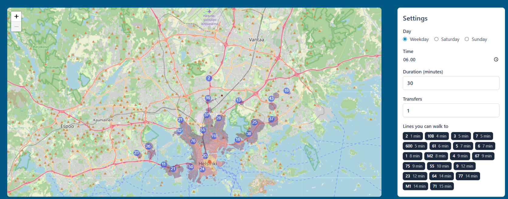

# Transport Map
 
Click anywhere on a map of the Helsinki region and see everywhere you could get to
by public transport within a given time — drawn as a shaded isochrone, clipped to
land, with the reachable stops and the lines you can walk to right now.
 
Journey planning is done with a from-scratch implementation of
**RAPTOR** (Round-bAsed Public Transit Optimized Router, Delling, Pajor & Werneck,
ALENEX 2012), running against HSL's GTFS feed. No routing library, no preprocessing
step, no external routing API.
 

 
## What it does
 
- **One-to-all reachability.** From any coordinate, at any time of day, for any
  travel budget — every stop you can reach, and how much time you'd have left.
- **Isochrone polygons.** Leftover time becomes a walking radius; the union of
  those circles is the reachable area, clipped to the coastline so it doesn't
  spill into the sea.
- **Service days.** Separate timetables for weekday, Saturday and Sunday, including
  the after-midnight services that GTFS files under the *previous* day at
  `24:00`–`27:00`.
- **Nearby lines.** The public line numbers (`550`, `9`, `M1`) departing from
  walkable stops inside the time window.
## How it works
 
**Backend** parses the GTFS feed once at startup and builds three timetables:
 
1. `stop_times.txt` is read once into ~394k trips.
2. `calendar.txt` + `trips.txt` decide which services run on each day type.
3. Trips are grouped into *routes* by identical stop sequence — the paper's
   definition, not GTFS's — which collapses ~24k weekday trips into ~950 routes.
4. Stops, coordinates, names and walking transfers (with transitive closure) are
   built once and shared across all three timetables.
A query then runs RAPTOR in rounds, where round *k* is "reachable using at most
*k* vehicles", with local pruning, the marked-stops optimisation and the time
budget standing in for target pruning. A full one-to-all query over 8,200 stops
takes about **20 ms**; building the isochrone polygons takes another ~250 ms.
 
**Frontend** is an Angular app with a Leaflet map. Clicking sets the origin;
changing any setting re-runs the query through a signal effect.
 
## Requirements
 
- Python 3.11+ and [uv](https://docs.astral.sh/uv/)
- Node 20+ (an active LTS)
## Setup
 
Clone, then install both halves.
 
### Backend
 
```bash
cd backend
uv sync
```
 
Place the GTFS files and the land polygon in `backend/data/`:
 
```
data/
  stops.csv
  stop_times.csv
  trips.csv
  routes.csv
  calendar.csv
  land.geojson
```
 
The GTFS files come from [HSL's open data](https://www.hsl.fi/en/hsl/open-data)
(CSV rather than the `.txt` names GTFS uses). `land.geojson` is generated once
from OSM land polygons — see [Preparing the land polygon](#preparing-the-land-polygon).
 
### Frontend
 
```bash
cd frontend
npm install
```
 
## Running
 
Two terminals.
 
```bash
# backend — http://127.0.0.1:8000
cd backend
uv run python -m uvicorn transport_map.api:app --reload
```
 
```bash
# frontend — http://localhost:4200
cd frontend
npx ng serve
```
 
Open <http://localhost:4200>. The dev server proxies `/api/*` to the backend, so
no CORS setup is needed.
 
Startup takes roughly 20 seconds while the feed is parsed and the three
timetables are built. Watch the log for the stop, route and trip counts — the
trips-per-route ratio should be somewhere around 25.
 
## API
 
Interactive docs at <http://127.0.0.1:8000/docs>.
 
| Endpoint | Description |
|---|---|
| `GET /reachable` | Reachable stops and time remaining at each |
| `GET /isochrone` | The same, plus banded isochrone polygons as GeoJSON and the lines departing nearby |
| `GET /healthz` | 503 until the timetables have finished loading |
 
Both take `lat`, `lon`, `at` (seconds after midnight), `budget` (seconds) and
`day` (`weekday` \| `saturday` \| `sunday`).
 
```
/isochrone?lat=60.17&lon=24.94&at=28800&budget=1800&day=weekday
```
 
## Preparing the land polygon
 
Isochrones are clipped to land so they don't cover open water. The polygon is
generated once from OpenStreetMap coastline data and committed.
 
1. Download **land polygons, WGS84, large polygons split** from
   [osmdata.openstreetmap.de](https://osmdata.openstreetmap.de/data/land-polygons.html).
2. Run the prep script (needs `pyogrio` and `geopandas`, which are *not* app
   dependencies — install them in a throwaway environment):
```python
from pyogrio import read_dataframe
from shapely.geometry import box
 
BBOX = (24.45, 60.05, 25.30, 60.40)          # the HSL service area
land = read_dataframe("land-polygons-split-4326/land_polygons.shp", bbox=BBOX)
clipped = land.clip(box(*BBOX))
clipped.geometry = clipped.geometry.simplify(0.0001)
clipped.to_file("data/land.geojson", driver="GeoJSON")
```
 
## Project layout
 
```
backend/
  data/                    GTFS feed + land.geojson
  src/transport_map/
    config.py              paths and tuning constants
    models.py              Geography, Timetable, Route
    parsing.py             GTFS readers
    raptor.py              the algorithm
    iso.py                 isochrone bands and GeoJSON
    api.py                 FastAPI app
frontend/
  src/app/
    components/map/        Leaflet map, isochrone rendering
    components/settings/   day / time / duration controls
    services/              HTTP client and shared signals
```
 
## Known limitations
 
- **Walking is straight-line**, not routed over streets. A circle can reach an
  island with no bridge. Clipping to land removes the worst of it; proper
  pedestrian routing would be a much larger project.
- **No public holidays.** Day types come from `calendar.txt`'s weekday flags;
  `calendar_dates.txt` exceptions are ignored, so Independence Day shows weekday
  service.
- **Weekday is one bucket**, so Monday's overnight tail comes from a weekday
  rather than from Sunday.
- **Memory.** The full feed parse peaks high and the process settles around
  850 MB, mostly allocator arenas rather than live data (~300 MB of that is real).
## Data & licences
 
- Timetables: [HSL open data](https://www.hsl.fi/en/hsl/open-data), CC BY 4.0
- Coastline: [OpenStreetMap](https://www.openstreetmap.org/copyright) contributors, ODbL
- Basemap tiles: OpenStreetMap contributors
- Outdoor features: [Maanmittauslaitos](https://www.maanmittauslaitos.fi/en) open data
## Reference
 
Delling, D., Pajor, T., & Werneck, R. (2012). *Round-Based Public Transit Routing.*
ALENEX 2012.
